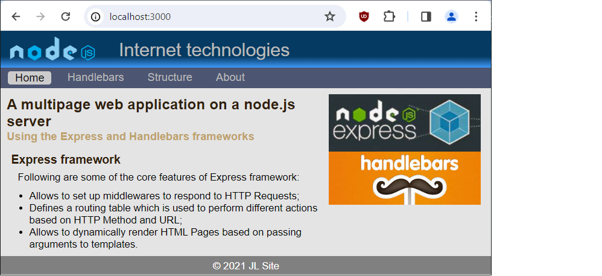

# A multipage web application on a node.js server

Using the Express and Handlebars frameworks

## Express framework

Node comes with a built-in http library, which is an http server. However, it is a simple server, e.g. you have to write the routing yourself and the library leads to problems and errors. A better way is to use the ready-made Express framework for Node.

Express is a minimal and flexible Node.js web application framework that provides a robust set of features to develop web and mobile applications. It facilitates the rapid development of Node based Web applications.

.

Following are some of the core features of Express framework:

- Allows to set up middlewares to respond to HTTP Requests;
- Defines a routing table which is used to perform different actions based on HTTP Method and URL;
- Allows to dynamically render HTML Pages based on passing arguments to templates.

## Handlebar framework

Handlebars is a web development framework that helps developers create dynamic, responsive web applications. It provides a number of features that make development faster and easier, including a template engine, data binding, and URL routing. Handlebars is open source and is available for use with a number of different programming languages.

Handlebars is a templating engine that allows you to easily separate your HTML from your application’s code.

## Directory structure

Start the node server with the command: "node app_express_hbs.js".
This file runs all the necessary frameworks, creates classes, variables and starts page rendering: [http://localhost:3000/]. Downloads the file [\views\index.hbs], converts it to html and sends it to the user's browser.

This file is a template: in order not to repeat writing the same elements: menu, header, footer - it takes them first from the [/partial] folder and the css files from [public/css]. It assembles the page content similarly to the mechanisms in ASP.NET: [Razor Pages] or [Master Pages].

The main file [node app_express_hbs.js] contains the definition of routing - switching pages depending on the address entered in the browser.

In your browser, enter the address: "http://localhost:3000/"
